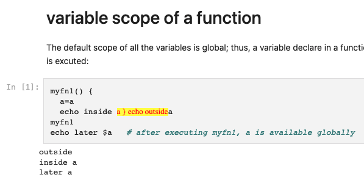

## To Run:

If you have already installed it, simply run 

```
pipenv run jupyter lab
```


## To Install:

Install the required Python package from pipfile:

```
PIPENV_VENV_IN_PROJECT=1 pipenv install
```

Initialized bash kernel:

```
pipenv shell 
python -m bash_kernel.install
```

Then you are ready to run Jupyter Lab with Bash kernel:

```
pipenv run jupyter lab
```

Ref: https://github.com/takluyver/bash_kernel


## To reinstall bash kernel if something goes wrong:

```
# List all kernels and grab the name of the kernel you want to remove
jupyter kernelspec list
# Remove it
jupyter kernelspec remove <kernel_name>
```

https://stackoverflow.com/questions/42635310/remove-kernel-on-jupyter-notebook


## :warning: Works on python 3.12, broken on python 3.13


## :warning: If you relocate this folder on your device, you have to:

1. remove and reinstall pipenv:
```
pipenv --rm
pipenv install
```

2. remove and reinstall Jupyter's bash kernel
```
pipenv shell 
jupyter kernelspec uninstall bash
python -m bash_kernel.install
```

Note: you can list the installed kernels with:

```
jupyter kernelspec list
```

Reference:

https://github.com/takluyver/bash_kernel

https://stackoverflow.com/questions/42635310/remove-kernel-on-jupyter-notebook


## Bugs

### Kernel sometimes does not work in VSCode

### Rendering on github is sometimes problematic:

see:  [mynote--bash-scripting/contents/variable-scope/variable-scope-of-a-function/variable-scope-of-a-function.ipynb at main · ApolloTang/mynote--bash-scripting](https://github.com/ApolloTang/mynote--bash-scripting/blob/main/contents/variable-scope/variable-scope-of-a-function/variable-scope-of-a-function.ipynb) 



