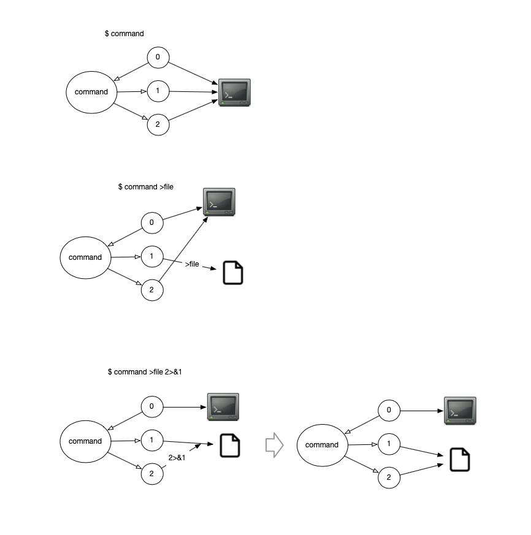
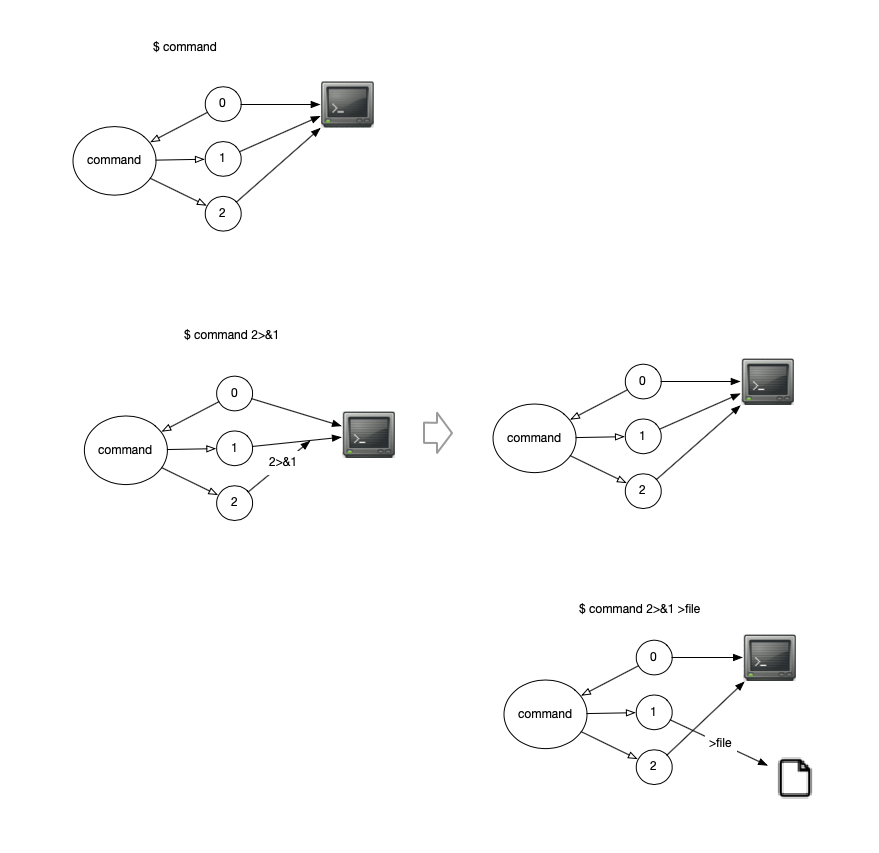

# The order of redirects matters in bash

The following command: 
```
command >file.txt 2>&1
```
is not the same as:

```
command 2>&1 >file.txt
```

[link to ipynb](./ipynb--the-order-of-redirects-matters-in-bash/index.ipynb)

Let's demostrate this.

I have a simple script (called myscript.sh):
```bash
#!/usr/bin/env sh

echo 'some message'       # Goes to stdout by default
echo 'error message' >&2  # Redirects to stderr explicitly
```

In the script, the first echo goes to `stdout`, and the second is explicitly directed to `stderr`. So when running the script, both `stdout` and `stderr` received a their own stream of text.

## Study1

```bash
$ ./myscript.sh >file.txt 2>&1
```
There is no output in the terminal, but a file is created:

```bash
$ tree -F
./
└── file.txt
```
The content of `file.txt` is:
```txt
$ cat file.txt
some message
error message
```
Both the `stdout` and `stderr` have streamed into this file. The following diagram illustare the file descriptor for this study:



## Study2

```bash
$ ./myscript.sh 2>&1  >file.txt
error message
```
An error message (`strerr` stream) is shown in the terminal and a file is created:

```bash
$ tree -F
./
└── file.txt
```
The content of `file.txt` is:
```txt
$ cat file.txt
some message
```
Only the `stdout` is streamed into this file. The following diagram illustare the file descriptor for this study:


